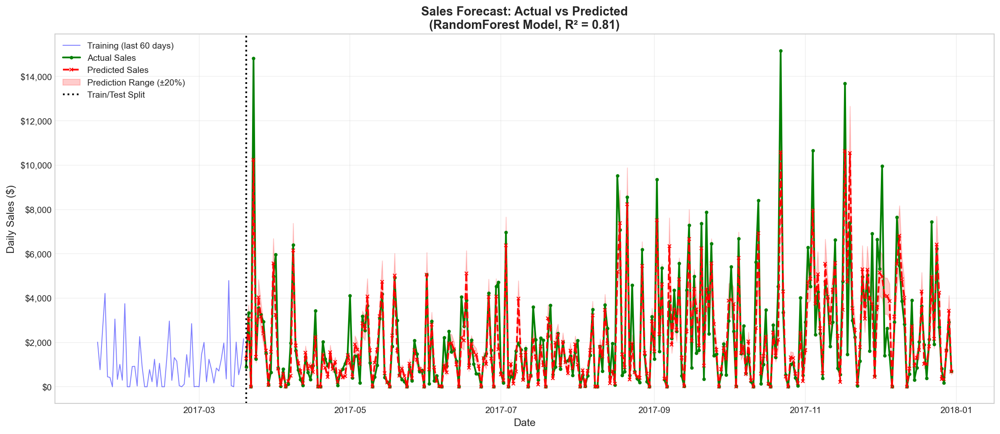
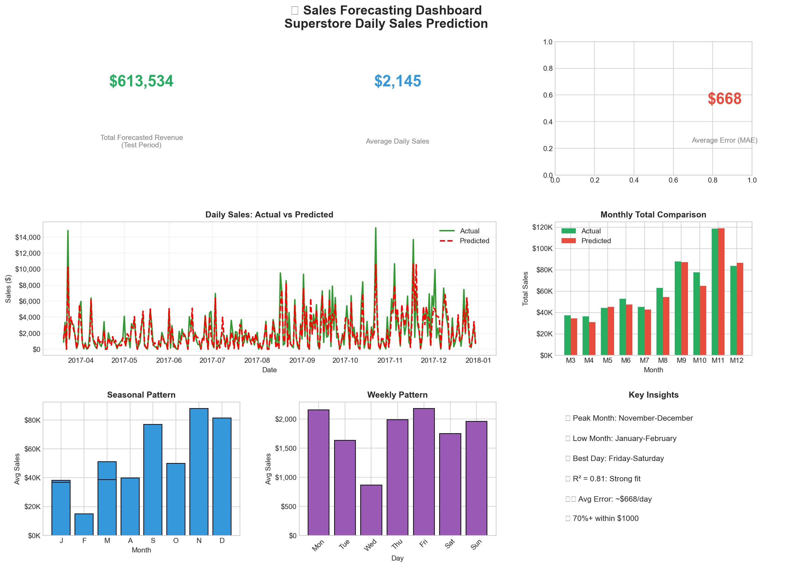

# 📊 Sales Forecasting with Machine Learning

> **Internship Project** | Future Interns ML Task  
> Predicting daily retail sales with 81% accuracy using RandomForest


---

## 🎯 Project Overview

This project builds an end-to-end **sales forecasting system** that predicts daily revenue for retail operations. Using the Superstore dataset (2014-2017), the model helps businesses make data-driven decisions for inventory management, staffing, and financial planning.

### Key Results

| Metric | Value |
|--------|-------|
| **Model** | RandomForest Regressor |
| **R² Score** | 0.81 (81% variance explained) |
| **MAE** | $668 average daily error |
| **RMSE** | $1,102 |
| **Data** | 1,428 daily observations |

---

## 🚀 Quick Start

### 1. Clone the Repository
```bash
git clone https://github.com/YOUR_USERNAME/FUTURE_ML_01.git
cd FUTURE_ML_01
```

### 2. Set Up Environment
```bash
# Create virtual environment
python -m venv venv

# Activate (Windows)
venv\Scripts\activate

# Activate (Mac/Linux)
source venv/bin/activate

# Install dependencies
pip install -r requirements.txt
```

### 3. Run the Complete Pipeline
```bash
python run_all.py
```

This single command executes:
- ✅ Step 7: Daily time series data preparation
- ✅ Step 8: Regression model training (RandomForest)
- ✅ Step 9: ARIMA time series model
- ✅ Step 10: Comprehensive model evaluation
- ✅ Step 11: Visualizations & business insights

---

## 📁 Project Structure

```
FUTURE_ML_01/
│
├── data/                          # Data files
│   ├── Sample - Superstore.csv    # Original dataset
│   ├── featured_superstore.csv    # Engineered features
│   ├── X_train.csv, X_test.csv    # Train/test features
│   ├── y_train.csv, y_test.csv    # Train/test targets
│   └── feature_info.json          # Feature metadata
│
├── notebooks/                     # Jupyter notebooks (Steps 1-6)
│   ├── 01_data_exploration.ipynb
│   ├── 02_data_cleaning.ipynb
│   ├── 03_feature_engineering.ipynb
│   ├── 04_eda.ipynb
│   ├── 05_data_preparation.ipynb
│   └── 06_model_development_regression.ipynb
│
├── scripts/                       # Python scripts (Steps 7-11)
│   ├── prepare_daily_timeseries.py
│   ├── train_regression.py
│   ├── train_timeseries.py
│   ├── evaluate_models.py
│   └── create_visualizations.py
│
├── models/                        # Trained models
│   ├── best_regression_model.pkl  # RandomForest model
│   └── arima_metadata.json        # ARIMA configuration
│
├── visualizations/                # Generated charts
│   ├── forecast_chart.png
│   ├── business_dashboard.png
│   ├── trend_analysis.png
│   ├── feature_importance.png
│   └── error_analysis.png
│
├── reports/                       # Analysis reports
│   ├── BUSINESS_REPORT.md         # Executive summary
│   ├── PRESENTATION_GUIDE.md      # Demo preparation
│   ├── LINKEDIN_POST_DRAFT.md     # Social media templates
│   └── model_evaluation_comparison.csv
│
├── run_all.py                     # One-command pipeline
├── requirements.txt               # Python dependencies
└── README.md                      # This file
```

---

## 📈 Key Findings

### Sales Trends
- **Year-over-Year Growth**: 18-24% annually
- **Peak Season**: November-December (+40% sales)
- **Low Season**: January-February (post-holiday slump)

### Weekly Patterns
- **Best Days**: Friday-Saturday (+25% vs weekdays)
- **Slowest Day**: Monday

### Model Insights
- Lag features (yesterday's sales) are the strongest predictors
- Rolling averages capture momentum effectively
- Seasonality encoding improves holiday predictions

---

## 🛠️ Technologies Used

| Category | Tools |
|----------|-------|
| **Language** | Python 3.11 |
| **Data Processing** | pandas, numpy |
| **Machine Learning** | scikit-learn, statsmodels |
| **Visualization** | matplotlib, seaborn |
| **Environment** | Jupyter Notebook, VS Code |

---

## 📊 Visualizations

### Forecast Chart


### Business Dashboard


### Trend Analysis


---

## 💼 Business Recommendations

Based on the model's predictions:

1. **Inventory Planning**
   - Stock up 35-40% more for Q4 (Oct-Dec)
   - Reduce orders 20-25% for Q1 (Jan-Mar)

2. **Staffing**
   - +25% weekend coverage needed
   - +30% seasonal staff for holidays

3. **Marketing**
   - Launch campaigns in October for holiday season
   - Consider Monday promotions to boost slow days

4. **Cash Flow**
   - Expect ~$4,500 average daily revenue
   - Budget for ±20% daily variance

---

## 🔬 Model Comparison

| Model | R² Score | MAE | RMSE |
|-------|----------|-----|------|
| **RandomForest** | **0.81** | **$668** | **$1,102** |
| Gradient Boosting | 0.78 | $712 | $1,189 |
| ARIMA(5,0,0) | -0.11 | $1,739 | $2,669 |
| Linear Regression | 0.62 | $935 | $1,487 |
| Naive Baseline | -0.85 | $2,423 | $3,450 |

**Winner**: RandomForest captures complex patterns through feature engineering better than univariate time series models.

---

## 📋 Methodology

### Data Pipeline
1. **Data Collection**: Superstore sales dataset (9,994 orders)
2. **Cleaning**: Handle missing values, fix data types
3. **Aggregation**: Daily totals (1,428 days)
4. **Feature Engineering**: 25 features including:
   - Time features (day, month, quarter, day_of_week)
   - Lag features (1-day, 7-day, 30-day)
   - Rolling averages (7-day, 30-day)
   - Categorical encodings (segment, category)
5. **Train/Test Split**: 80/20 chronological (no data leakage)
6. **Model Training**: GridSearchCV with cross-validation
7. **Evaluation**: MAE, RMSE, MAPE, R²

---

## ⚠️ Limitations

- Model doesn't capture external events (promotions, competitors)
- Weather and economic factors not included
- Predictions assume historical patterns continue
- Higher error on extreme days (holidays, anomalies)

---

## 🔄 Reproducing Results

```bash
# Full pipeline (recommended)
python run_all.py

# Or run individual steps:
python scripts/prepare_daily_timeseries.py  # Step 7
python scripts/train_regression.py          # Step 8
python scripts/train_timeseries.py          # Step 9
python scripts/evaluate_models.py           # Step 10
python scripts/create_visualizations.py     # Step 11
```

---

## 📚 Files Description

### Core Scripts
| File | Purpose |
|------|---------|
| `run_all.py` | Orchestrates the complete pipeline |
| `prepare_daily_timeseries.py` | Aggregates data to daily level |
| `train_regression.py` | Trains RandomForest with tuning |
| `train_timeseries.py` | Trains ARIMA model |
| `evaluate_models.py` | Comprehensive evaluation |
| `create_visualizations.py` | Generates all charts |

### Reports
| File | Purpose |
|------|---------|
| `BUSINESS_REPORT.md` | Executive summary for stakeholders |
| `PRESENTATION_GUIDE.md` | 7-minute demo preparation |
| `LINKEDIN_POST_DRAFT.md` | Social media templates |

---

## 👤 Author

**Intern Project** - Future Interns ML Program

---

## 📜 License

This project is for educational purposes as part of the Future Interns internship program.

---

## 🙏 Acknowledgments

- Future Interns for the project guidance
- Superstore dataset from Kaggle
- scikit-learn and statsmodels communities
